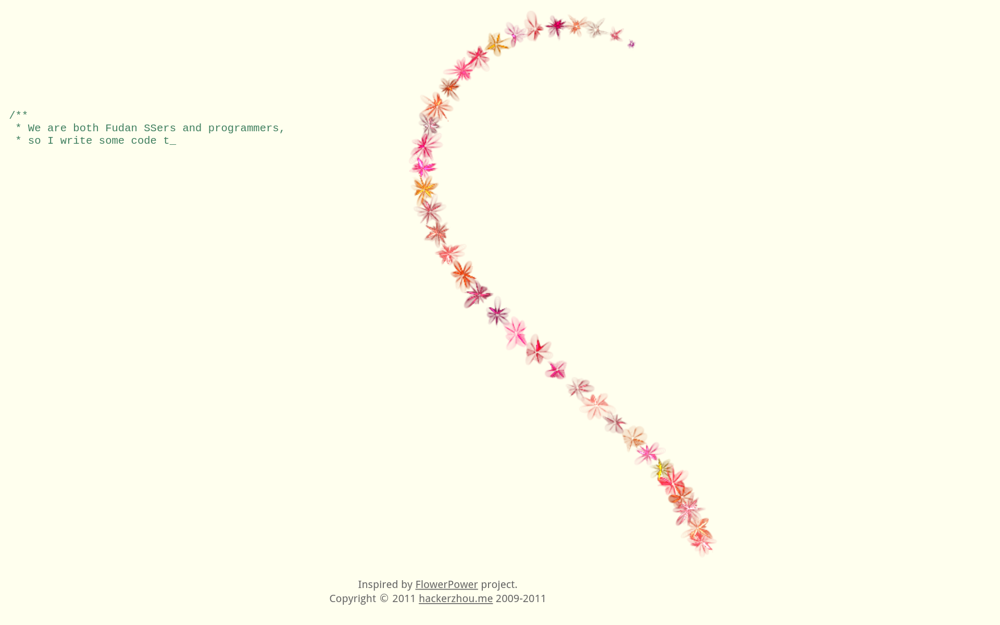
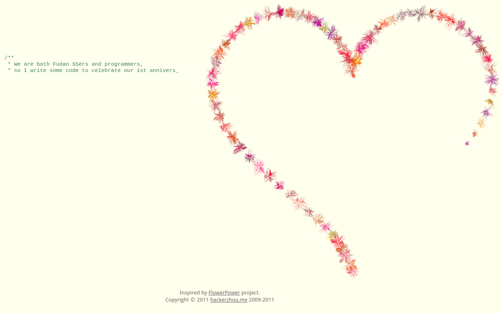
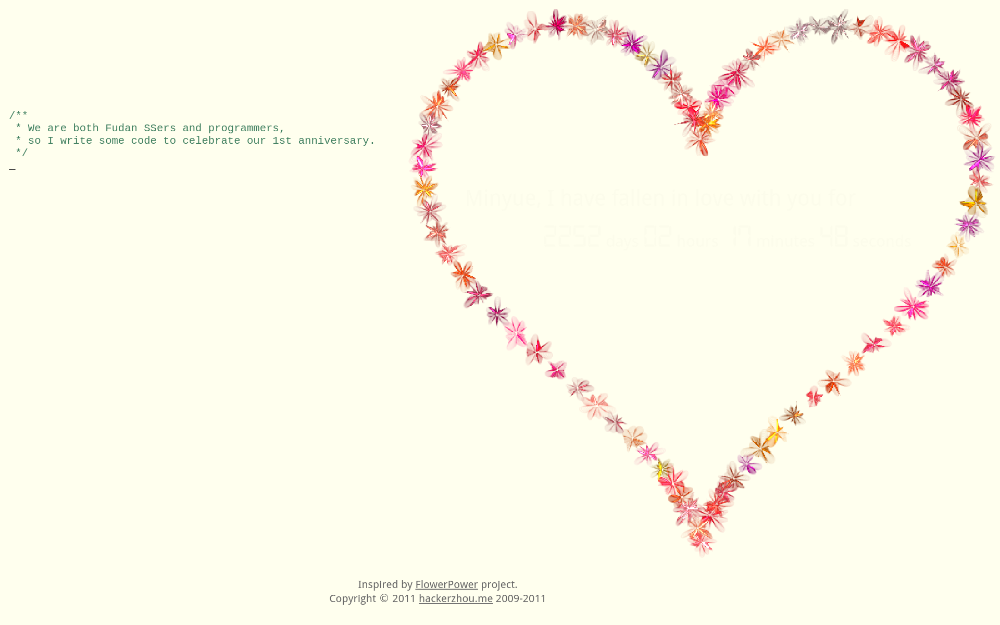
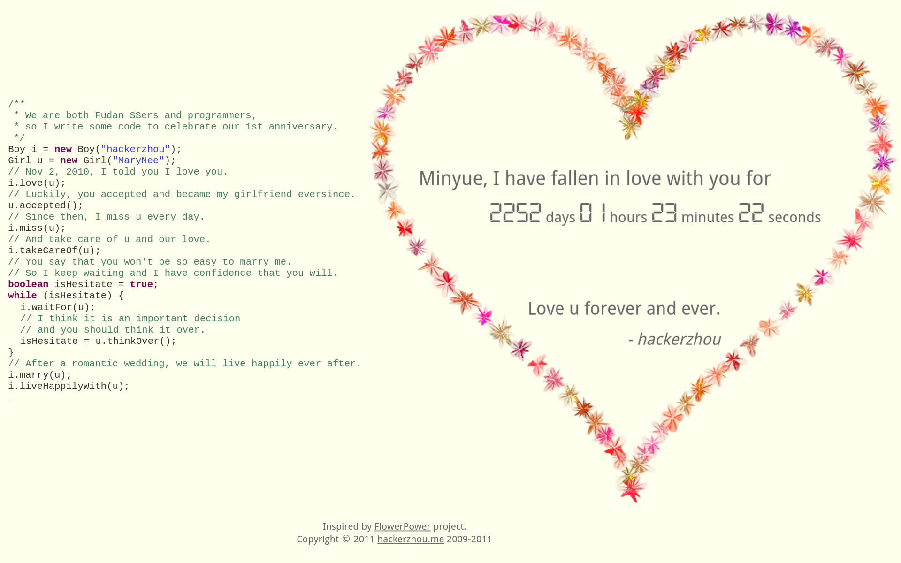

# Love

[](https://github.com/mutse/love/releases/latest)
[](https://github.com/mutse/love/blob/master/LICENSE)
[](https://uappexplorer.com/app/love.mutse)


## Screenshots





## About
This is a love app for Ubuntu Touch, it will tell your a love stroy of
[hackerzhou](https://github.com/hackerzhou)(not me). And this repo is forked from [Love](https://github.com/hackerzhou/Love).

+ Coding with a love stroy
+ Playing a love song automatically

## Install
You can find the latest click package in [**HERE**](https://github.com/mutse/love/releases).
Copy the .click file to phone's home folder via adb: `adb push <PACKAGE-FILE> /home/phablet/`
Run `adb shell 'pkcon install-local --allow-untrusted <PACKAGE-FILE>'` to install.

Now, you can also find & install it from [uApp Explorer](https://uappexplorer.com/app/love.mutse).

## Build
You can get the source code from github with git, and then build it as following commands:

```bash
$ git clone https://github.com/mutse/love.git
$ click build love
```

## License

Copyright (C) 2016-2017  [Mutse](https://mutse.github.io)

This program is free software: you can redistribute it and/or modify
it under the terms of the GNU General Public License as published by
the Free Software Foundation, either version 3 of the License, or
(at your option) any later version.

This program is distributed in the hope that it will be useful,
but WITHOUT ANY WARRANTY; without even the implied warranty of
MERCHANTABILITY or FITNESS FOR A PARTICULAR PURPOSE.  See the
GNU General Public License for more details.

You should have received a copy of the GNU General Public License
along with this program.  If not, see <http://www.gnu.org/licenses/>.
